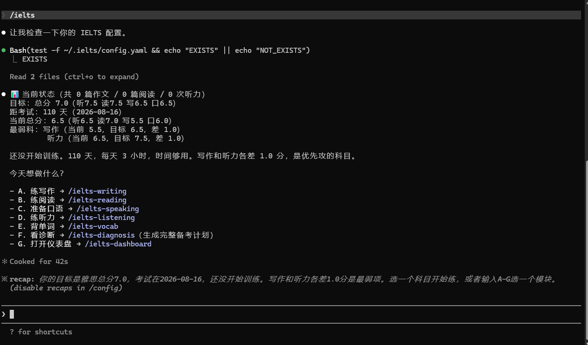
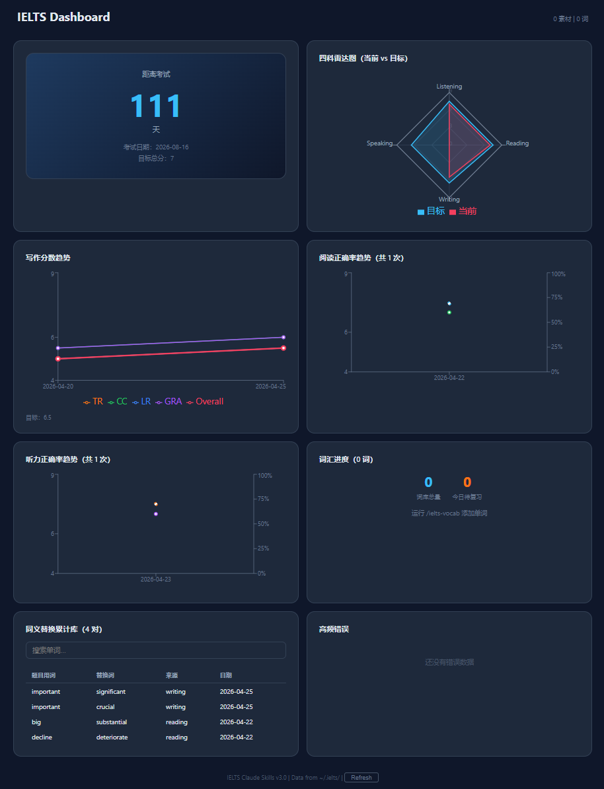

# Awesome IELTS Claude Skills 

> 一套跑在 Claude Code 上的雅思备考 AI 教练系统。
> **数据持久化 + 8 个 Skill + React Dashboard 可视化。**

## 🌟 效果演示

**1. 终端交互 (CLI)** - 智能路由与进度追踪


**2. 数据可视化 (Dashboard)** - 科学量化你的备考趋势


---

## 这是什么

8 个 [Claude Code Skill](https://docs.claude.com/en/docs/claude-code/skills)，构成完整的雅思备考助手：

| Skill | 干啥 | 触发词 |
|-------|------|--------|
| `/ielts` | 路由入口 + 摸底 + 给建议 | 「我要备考雅思」「IELTS」 |
| `/ielts-writing` | 写作四维批改 + 改写对比 + 审题 + 历史趋势 | 「批改作文」「帮我看看这篇」 |
| `/ielts-reading` | 同义替换提取 + T/F/NG 拆解 + 错题诊断 + 数据存档 | 「分析阅读」「这道为什么错」 |
| `/ielts-speaking` | 5 个万能故事覆盖 80% Part 2 话题 + 素材存档 | 「口语素材」「Part 2 准备」 |
| `/ielts-listening` | 听力错题分析 + 题型追踪 + 精听训练 | 「听力分析」「练精听」 |
| `/ielts-vocab` | 间隔重复 + 同义替换专练 + 写作高频词 | 「背单词」「同义替换」 |
| `/ielts-diagnosis` | 数据驱动诊断 + 个性化备考计划 | 「诊断」「备考计划」 |
| `/ielts-dashboard` | 启动 React Dashboard 可视化 | 「打开仪表盘」「看看进度」 |

---

## v3.0 新功能

- **数据持久化** — `~/.ielts/` 跨会话记忆，所有训练数据自动存档
- **批改历史** — 每篇作文/阅读/听力自动归档，带评分
- **进度追踪** — 自动统计四科趋势
- **可视化 Dashboard** — 本地 React 网页：趋势图 / 雷达图 / 错题热力图
- **错题本** — 自动聚合高频错误标签
- **同义替换库** — 跨篇累计，可搜索
- **备考计划** — 数据驱动诊断 + 个人化训练计划
- **听力错题分析** — 题型追踪 + 精听任务
- **词汇训练** — 间隔重复 + 同义替换专项
- **备份 / 迁移** — 一键 backup / restore

---

## 安装

### 前提
你要先装好 [Claude Code](https://docs.claude.com/en/docs/claude-code) 和 [Node.js](https://nodejs.org/)（≥ 18）。

### 方法一：直接复制

```bash
# Mac / Linux
cp -r ielts ielts-writing ielts-reading ielts-speaking \
      ielts-listening ielts-vocab ielts-diagnosis ielts-dashboard \
      ~/.claude/skills/
```

```powershell
# Windows PowerShell
$skills = @('ielts','ielts-writing','ielts-reading','ielts-speaking','ielts-listening','ielts-vocab','ielts-diagnosis','ielts-dashboard')
foreach ($s in $skills) {
    Copy-Item -Recurse $s "$env:USERPROFILE\.claude\skills\$s"
}
```

### 方法二：克隆

```bash
git clone https://github.com/YANZHANLIN/ielts-claude-skills.git
cd ielts-claude-skills
# 复制 skills（同上）
```

### 初始化数据目录

```bash
# Mac / Linux
bash scripts/init.sh

# Windows PowerShell
.\scripts\init.ps1
```

这会创建 `~/.ielts/` 目录结构和初始配置文件。

### 安装 Dashboard 依赖

```bash
cd dashboard
npm install
```

装完之后重启 Claude Code，输入 `/ielts` 就能用。

---

## 怎么用

### 首次使用

```
你：/ielts
AI：（问你 3 个问题：目标分、考试日期、今天想练啥）
   → 创建 ~/.ielts/config.yaml
   → 路由到对应的子 skill
```

### 批改作文（自动存档）

```
你：/ielts-writing
   [粘贴题目 + 你的作文]
AI：
- 四维评分（TR / CC / LR / GRA）
- 句子级标注每个问题
- 改写成目标分数版本
- 显示历史趋势："这是你第 5 篇，TR 从 5.0 → 5.5"
- 自动存档到 ~/.ielts/writing/essays/
```

### 分析阅读错题（自动存档）

```
你：/ielts-reading
   [粘贴文章 + 题目 + 你的答案 + 标准答案]
AI：
- 逐题拆解错因
- 提取同义替换词表
- T/F/NG 逻辑分析
- 自动存档 + 更新同义替换库
```

### 看诊断报告

```
你：/ielts-diagnosis
AI：
- 读取所有历史数据
- 生成四科雷达图数据
- 目标 vs 现状差距分析
- 提分优先级排序
- 生成个性化备考计划
```

### 打开 Dashboard

```
你：/ielts-dashboard
AI：
- 导出最新数据
- 启动 Vite dev server
- 浏览器打开 http://localhost:5173
```

Dashboard 展示：
- 考试倒计时
- 写作四维分数走势图
- 四科雷达图（当前 vs 目标）
- 阅读/听力正确率趋势
- 同义替换累计库（可搜索）
- 高频错误 Top 10
- 词汇掌握进度

---

## 文件结构

```
ielts-claude-skills/
├── ielts/SKILL.md                     # 路由教练
├── ielts-writing/SKILL.md             # 写作批改
├── ielts-reading/SKILL.md             # 阅读分析
├── ielts-speaking/SKILL.md            # 口语素材
├── ielts-listening/SKILL.md           # 听力分析
├── ielts-vocab/SKILL.md               # 词汇训练
├── ielts-diagnosis/SKILL.md           # 诊断 + 计划
├── ielts-dashboard/SKILL.md           # Dashboard 启动
├── schemas/                           # Zod 数据校验
│   ├── config-schema.js
│   ├── writing-schema.js
│   ├── reading-schema.js
│   └── listening-schema.js
├── scripts/                           # 工具脚本
│   ├── init.sh                        # 初始化（Mac/Linux）
│   ├── init.ps1                       # 初始化（Windows）
│   ├── backup.sh                      # 备份
│   ├── restore.sh                     # 恢复
│   └── data-export.js                 # 数据导出 → JSON
├── dashboard/                         # React + Vite Dashboard
│   ├── package.json
│   ├── vite.config.js
│   └── src/
│       ├── App.jsx
│       ├── components/
│       │   ├── Countdown.jsx
│       │   ├── ScoreTrend.jsx
│       │   ├── RadarChart.jsx
│       │   ├── ReadingStats.jsx
│       │   ├── ListeningStats.jsx
│       │   ├── SynonymLib.jsx
│       │   ├── VocabProgress.jsx
│       │   └── ErrorHeatmap.jsx
│       └── utils/
│           ├── parser.js
│           └── aggregator.js
└── README.md
```

数据存储在 `~/.ielts/`（不在项目目录内）。

---

## 怎么改

1. Fork 一份
2. 改对应的 `SKILL.md`——人格、评分标准、模板都在里面
3. 改 `schemas/` 下的 zod schema——调整数据格式
4. 改 `dashboard/src/` ——调整可视化
5. 重新复制到 `~/.claude/skills/`
6. 重启 Claude Code

---

## 备份 / 迁移

```bash
# 备份
bash scripts/backup.sh
# 生成 ielts-backup-YYYYMMDD-HHMMSS.zip

# 恢复（换电脑时）
bash scripts/restore.sh ielts-backup-XXXXXXXX.zip

# 刷新 Dashboard 数据
node scripts/data-export.js dashboard/public/data
```

---

## License

[MIT](./LICENSE)
